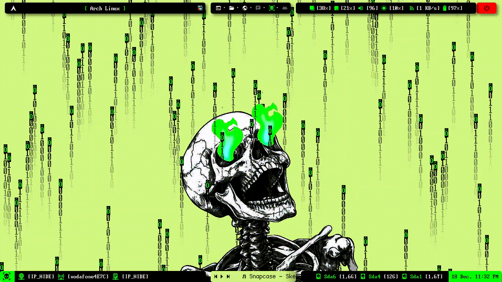
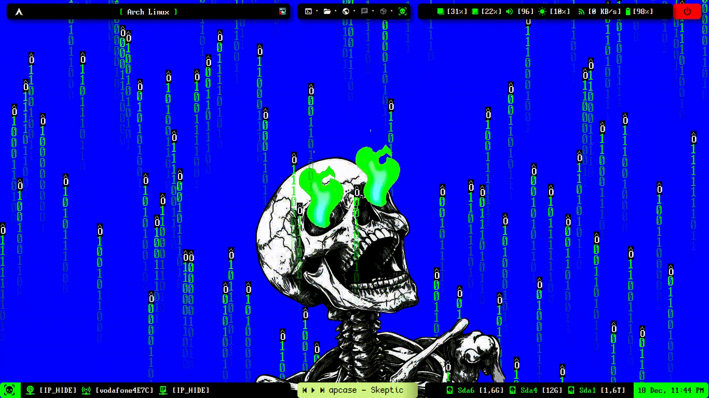

# NyxBackground

Este proyecto utiliza Python y Pygame para crear una animación personalizada en tu escritorio. Sigue los pasos a continuación para configurar el entorno y ejecutar el script.

---

## ⚙️ Pasos de instalación

### 1. Clonar este repositorio
Primero, clona el repositorio en tu equipo local usando el siguiente comando:
```
git clone https://github.com/Nyxherof3r/nyxbackground.git
```
### 2. Crear la carpeta de destino
Copia el contenido del repositorio en la carpeta ~/scripts/nyxbackground. Puedes crear esta carpeta ejecutando:
```
mkdir -p ~/scripts/nyxbackground
```
Luego, copia todo el contenido del repositorio a esa carpeta:
```
cp -r nyxbackground/* ~/scripts/nyxbackground/
```
### 3. Crear un entorno virtual
Navega a la carpeta donde está el archivo Python y crea un entorno virtual:
```
cd ~/scripts/nyxbackground
python3 -m venv env
```
Activa el entorno virtual:
En Linux/Mac:
```
source env/bin/activate
```
### 4. Instalar las dependencias
Con el entorno virtual activado, instala las dependencias necesarias:
```
pip install pygame pillow
```
### 5. Ejecutar el script
Finalmente, ejecuta el script desde la misma carpeta para probar la animación:

```
python nyxbackground.py
```
A este paso ya ves la animacion de phyton en pantalla completa... hay otras maneras pero use "feh" para que se vea como fondo de pantalla en todos los escritorios

---
### ⚙️ Pasos para fondo de pantalla de la animacion python
Descomentar estas lineas del archivo nyxbackground.py cuando ya estas deacuerdo con la personalizacion de python 
````
    #frame_path = os.path.join(frames_folder, f"frame_{frame_count:04d}.png")
    #pygame.image.save(screen, frame_path)
    #frame_count += 1
````
Al descomentar crea las imagenes es normal que se vea un poco lento porque crea muchas pero las crea bien y crea una carpeta llamada frame en la misma carpeta donde esta la animacion python.
### Script para visualizar todas las imagenes de la carpeta frame
Darle los permisos de ejecucion
```
chmod +x ~/scripts/nyxbackground/animated_background.sh
```
### Consideraciones para entorno de escritorio
### fondo animado en BSPWM
agregar el script al archivo bspwmrc asi
````
#! /bin/sh
# Iniciar sxhkd
pgrep -x sxhkd > /dev/null || sxhkd &
# Configuración de bspwm
bspc monitor -d '1' '2' '3' '4' '5' '6'
xsetroot -cursor_name left_ptr
# Ejecutar el script de fondo animado
~/scripts/nyxbackground/animated_background.sh &
...
````
### Otros entornos de escritorio
1. Crear la carpeta autostart-script. la carpeta donde se alojarán los scripts de inicio automático. Esto lo haces con:
```
mkdir -p ~/.config/autostart-scripts
```
2. Copiar el script al directorio de inicio
```
cp ~/scripts/nyxbackground/animated_background.sh ~/.config/autostart-scripts/
```
3. Dar permisos de ejecución al script
```
chmod +x ~/.config/autostart-scripts/animated_background.sh
```
Esto permite que el sistema pueda ejecutarlo automáticamente al iniciar sesión.

Evitar que Plasma gestion en el fondo:
-Desactiva el fondo de escritorio en KDE. Haz esto:
-Ve a Configuración del Sistema > Fondo de pantalla. Configura el fondo como "Sin imagen" o un fondo vacío.

---
### 📂 Estructura del proyecto
````
nyxbackground/
├── nyxbackground.py        # Archivo principal python
├── frames/                 # Carpeta donde se guardan los frames generados
├── skull.gif               # Archivo de ejemplo para el GIF animado
└── animated_background.sh  # Script para visualizar frames para fondo de pantalla
````
### 🛠️ Notas
- Asegúrate de tener Python 3 instalado en tu sistema.
- Si experimentas algún problema al ejecutar el script, verifica la ruta del archivo de fuente o del GIF animado.

### 🖼️ Captura de pantalla

Aquí tienes una vista previa del proyecto:



Pueden modificar como quieran el color tipografia o imagen


